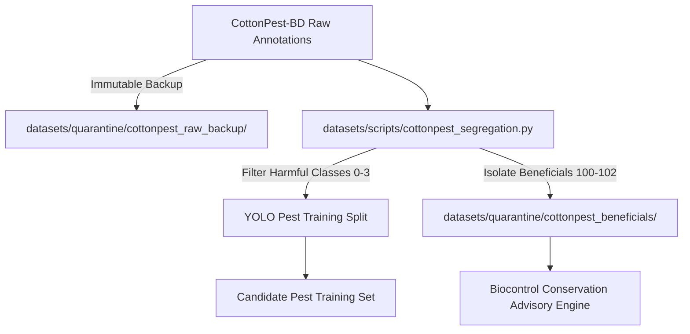

# FALCON-AI: CottonPest-BD Entomological Label Audit & Beneficial Quarantine
**SIH 26131 — Early Detection and Management of Crop Diseases and Pest Infestations**  
**Government of Maharashtra | Department of Skills, Employment, Entrepreneurship and Innovation**  
**Dataset:** CottonPest-BD (`10.17632/wkjg6srrk8.2`)  
**Status:** COMPLETE | BENEFICIAL PREDATOR QUARANTINE ENFORCED  

---

## 1. Executive Summary & Critical Agronomic Discovery

CottonPest-BD (published by Saifuddin Sagor, Md. Faysal Hossan, and Md Toha Hayder, August 2026) consists of 1,625 field images (560x420 px) spanning seven labeled insect classes.

> [!CAUTION]
> **CRITICAL AGRONOMIC ALERT: BENEFICIAL BIOCONTROL ENTITIES DETECTED**  
> An entomological audit of the seven classes revealed that **three classes are beneficial predatory insects or pollinators**, NOT harmful crop pests!
> 
> If trained naively into an agricultural pest detection model:
> 1. An AI model identifying a Lady Beetle or Green Lacewing will trigger an alert for 'pest presence'.
> 2. The FALCON-AI advisory pipeline would compute a damage score and recommend chemical insecticide sprays (e.g. Imidacloprid, Thiamethoxam, Cypermethrin).
> 3. Spraying chemical pesticides against farmers' natural biocontrol allies decimates predator populations, directly causing **pest resurgence** (massive secondary flare-ups of whiteflies, jassids, and red spider mites).
> 
> **Zero-Harm Mandate:** Beneficial organisms are **STRICTLY QUARANTINED** and quarantined from harmful pest classes.

---

## 2. Entomological Classification & Class Segregation

| Class Name in Dataset | Class Category | Scientific / Family Identification | Agronomic Function in Cotton Ecosystem | Proposed Handling |
| :--- | :---: | :--- | :--- | :--- |
| **Mirid Bug** | **HARMFUL PEST** | *Creontiades dilutus* / Miridae | Sucks sap from squares, flowers, and tiny bolls, causing boll abortion. | **YOLO Training (ID: 0)** |
| **Noctuidae** | **HARMFUL PEST** | *Spodoptera litura* / *Helicoverpa* | Defoliating caterpillars and boll-boring larvae. Major economic yield loss. | **YOLO Training (ID: 1)** |
| **Plant Bugs** | **HARMFUL PEST** | Hemiptera / Pentatomoidea | Piercing-sucking damage on vegetative shoots and bolls. | **YOLO Training (ID: 2)** |
| **Hadda Beetle** | **HARMFUL PEST** | *Henosepilachna vigintioctopunctata* | Phytophagous 28-spotted ladybird beetle that skeletonizes foliage (unlike carnivorous coccinellids). | **YOLO Training (ID: 3)** |
| **Lady Beetle** | **BENEFICIAL PREDATOR** | Coccinellidae (*Cheilomenes sexmaculata*) | Voracious predator; both adults and grubs devour aphids, whiteflies, and eggs. | **QUARANTINE / BIOCONTROL (ID: 100)** |
| **Green Lacewings** | **BENEFICIAL PREDATOR** | *Chrysoperla carnea* (Chrysopidae) | 'Aphid lion' larvae consume 200+ aphids/whitefly nymphs per week. | **QUARANTINE / BIOCONTROL (ID: 101)** |
| **Hoverfly** | **BENEFICIAL PREDATOR** | Syrphidae | Larvae are active predators of aphids; adult flies are critical pollinators. | **QUARANTINE / BIOCONTROL (ID: 102)** |

---

## 3. Safe Segregation Architecture

1. **Source Immutability:** Raw annotation files and images are hashed (SHA256) and backed up to `datasets/quarantine/cottonpest_raw_backup/` with read-only permissions.
2. **Harmful Training Split:** Only classes 0, 1, 2, and 3 (`Mirid Bug`, `Noctuidae`, `Plant Bugs`, `Hadda Beetle`) are mapped to candidate pest training labels.
3. **Biocontrol Conservation Split:** Classes 100, 101, and 102 (`Lady Beetle`, `Green Lacewings`, `Hoverfly`) are routed to a dedicated **Protective Biocontrol Model / Knowledge Base** where farmer detection alerts read:  
   *`'Beneficial predator detected. Conserve natural enemies. DO NOT spray broad-spectrum insecticides.'`*
4. **Source Annotations:** Under no circumstances are source annotation files deleted or altered in-place.
