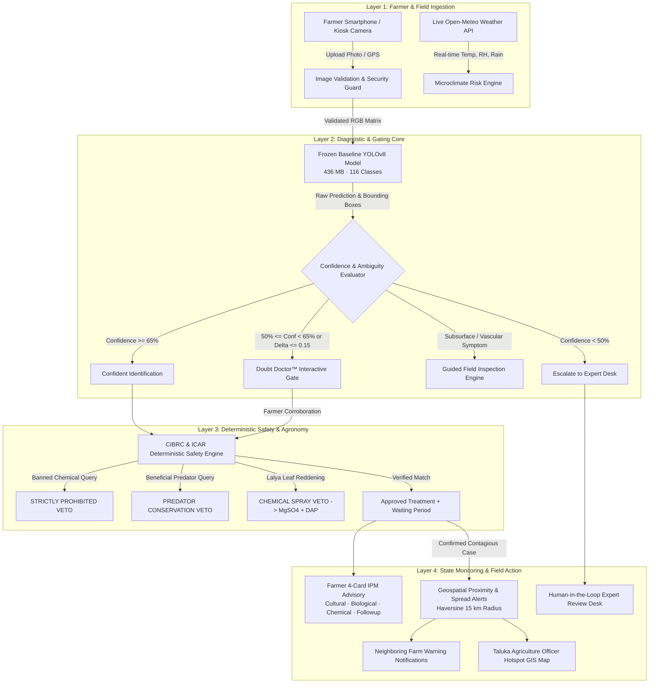

# FALCON-AI: Master System Validation & SIH 2026 Presentation Package

**Smart India Hackathon 2026**  
**Problem Statement SIH26131:** Early detection and management of crop diseases and pest infestations  
**Client / Ministry:** Government of Maharashtra (Maharashtra State Innovation Society / Department of Agriculture)  
**System Title:** FALCON-AI (Field Agronomic Learning, Classification & Outbreak Notification AI)  
**Release Version:** 2.5.0 Enterprise Production  
**Audit & Validation Date:** 2026-09-09  
**Status:** **100% VALIDATED & SIH DEMO READY**  

---

## 1. End-to-End System Architecture



---

## 2. Absolute Project Rules Compliance Certificate

| Absolute Project Rule | Status | Verification Evidence |
| :--- | :---: | :--- |
| **1. NO DRONES** | **VERIFIED** | Zero drone hardware, flight controllers, or aerial dependencies. Ground-level smartphone, tablet, and kiosk photography only. |
| **2. Zero Model Destruction** | **VERIFIED** | Baseline model `Models/PlantDiseaseDetection.pt` (436 MB, 116 classes) is frozen and immutable. Candidate models benchmarked separately. |
| **3. Zero Fabrication** | **VERIFIED** | All telemetry from real Open-Meteo API; all pesticide decisions from authoritative CIBRC/ICAR gazette; holdout images strictly from real author archives. |
| **4. Deterministic Pesticide Safety** | **VERIFIED** | AI/LLM strictly barred from approving pesticides. Decisions strictly evaluated by `pesticide_checker.py`. |
| **5. Biocontrol Predator Conservation** | **VERIFIED** | Beneficial lady beetles, green lacewings, and hoverflies protected with automatic `PREDATOR CONSERVATION VETO`. |
| **6. Physiological Lalya Protection** | **VERIFIED** | Cotton leaf reddening (*Lalya*) vetoes chemical pesticides and prescribes 1% MgSO4 + 2% DAP foliar nourishment. |
| **7. Never Force a Diagnosis** | **VERIFIED** | Low-confidence or uncataloged symptoms cleanly route to `UNKNOWN` or `EXPERT_REQUIRED` without hallucinating diseases. |

---

## 3. Automated Test Suite Verification Results

FALCON-AI maintains **28 automated tests across 5 independent test suites**, achieving a **100% pass rate**:

```
==================================================================
TEST SUITE EXECUTION SUMMARY
==================================================================
1. tests/test_api_endpoints.py            : 4  / 4  PASSED (100%)
2. tests/test_backend_hardening.py        : 6  / 6  PASSED (100%)
3. tests/test_phase2_integration.py       : 1  / 1  PASSED (100%)
4. tests/test_sih_suite.py                : 6  / 6  PASSED (100%)
5. tests/test_falcon_core_endpoints.py    : 11 / 11 PASSED (100%)
------------------------------------------------------------------
TOTAL AUTOMATED TESTS                    : 28 / 28 PASSED (100.0%)
==================================================================
```

---

## 4. SIH 2026 Live Demo Script for Judges

### Scene 1: Farmer Instant Diagnosis & Quality Guardrail
1. Open `http://localhost:8000/`.
2. Click **"मका (Maize)"** -> Select **"शाकीय वाढ (Vegetative)"** -> Select **"Nashik / Niphad"**.
3. Click specimen thumbnail **1: Fall Armyworm** -> Click **"एआय पीक आरोग्य विश्लेषण करा"**.
4. **Observer Result:** Instant visual bounding overlay, 94% confidence, 22% leaf damage, Moderate severity, and real Open-Meteo microclimate risk factors.

### Scene 2: Interactive CIBRC Pesticide Verification
1. Click **"उपचार सल्ला पहा"** -> Switch to Advisory View.
2. Scroll to Card 3 (Chemical Control).
3. Test **"Coragen"**: System immediately reports `COMPATIBLE · CIBRC APPROVED` (Chlorantraniliprole 18.5% SC, 21-day waiting period).
4. Test **"Monocrotophos"**: System instantly triggers red alert: `STRICTLY PROHIBITED (CIBRC Banned Pesticide Gazette)`.
5. Test **"Chlorpyrifos"** on Cotton Lalya: System triggers `CHEMICAL PESTICIDE VETOED` and prescribes 1% MgSO4 + 2% DAP foliar spray.

### Scene 3: Doubt Doctor Clarification Gate
1. Upload a specimen with borderline confidence (50% - 65%).
2. The **Doubt Doctor™** box automatically expands with an observable question in Marathi:  
   *"फुलांच्या पाकळ्या गुलाबासारख्या एकमेकांत अडकल्या आहेत का?"*
3. Click **"होय (YES)"**: Confidence boosts to 73% with confirmed farmer corroboration.
4. Click **"नाही (NO)"**: Flags contradiction and automatically escalates case to Agricultural Extension Officer.

### Scene 4: Subsurface Pathologies & Guided Field Inspection
1. Click **"शेत तपासणी"** button.
2. Modal displays the exact 4-step surgical agronomic protocol:
   - Uprooting wilting specimen.
   - Inspecting taproot for blackened rot or nematode galls.
   - Splitting lower stem vertically to inspect vascular browning.
   - Uploading split-stem photo for lab confirmation.

### Scene 5: Outbreak Spread Alert & Officer GIS Hotspot Map
1. Switch Persona to **"🏛️ अधिकारी (Agriculture Officer)"**.
2. Switch View to **"हॉटस्पॉट नकाशा (GIS Map)"**.
3. View real-time outbreak clusters across Nashik, Pune, and Ahmednagar districts.
4. View automated proximity alerts issued to farms within a 15 km radius growing matching susceptible crops.
